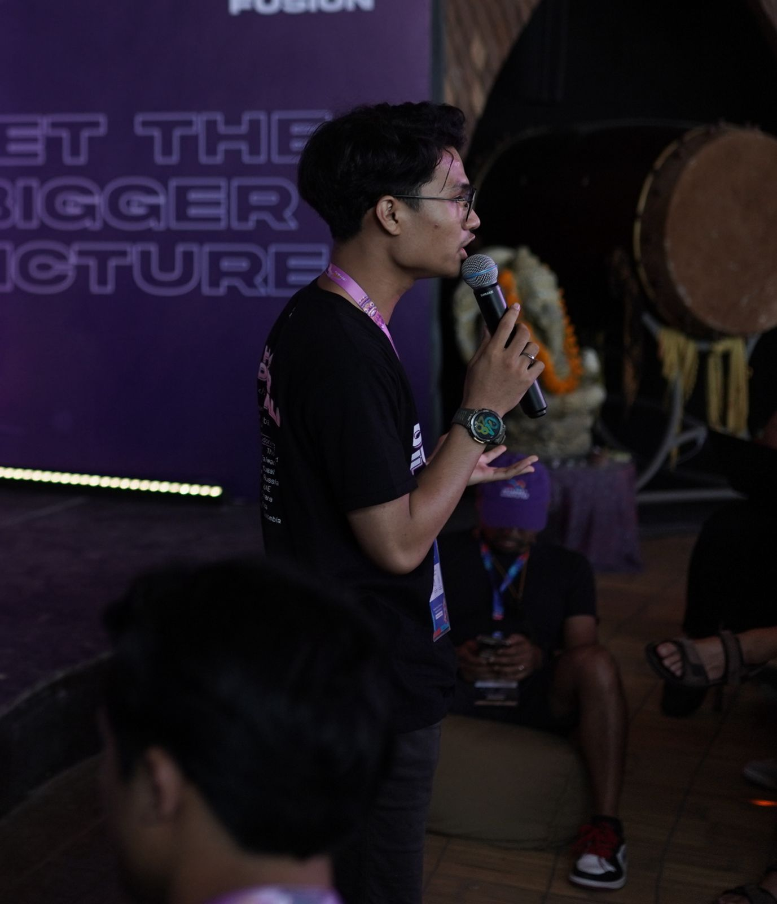
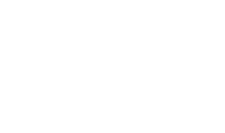

  

      
      

        <h1
          style="
            position: absolute;
            width: 1px;
            height: 1px;
            padding: 0;
            margin: -1px;
            overflow: hidden;
            clip-path: inset(50%);
            white-space: nowrap;
            border-width: 0;
          "
        >
          Ranaufal Muha
        </h1>
        
        <a
          href="#contact"
          style="
            background-color: white;
            padding: 10px 25px 10px 25px;
            text-decoration: none;
            color: black;
          "
          >Contact Me</a
        >
      

    

 <h1 align="center" style="margin-top: 20px; margin-bottom: 20px">
      Creative Frontend & Web3 Engineer
    </h1>
    

      I enjoy building things where design, code, and decentralized systems meet.
Most of my work revolves around interactive frontend experiences, smart contracts,
and turning Web3 ideas into real, usable products.
  
Lately, I’ve been spending a lot of time exploring blockchain architecture,
on-chain systems, and how decentralized infrastructure can actually make products better,
not just more complex.
    

  

---

## 📖 What I focus on

- **Creative Frontend Engineering** — interactive UI, motion, and visual details
- **Web3 & Smart Contract Development** — from Solidity to system design
- **Startup & Product Building** — building things from zero, not just features
- **Blockchain Research & Exploration** — learning how things work under the hood

---

## 🪅 Selected Projects

- **[PeridotVault](https://peridotvault.com/)** — a decentralized gaming distribution platform I’m building
- **[Merai](https://merai.tech/)** — a creative web agency focused on interactive, high-end websites
- **[Arctis](https://arctis-web.vercel.app/)** — open-source UI experiments with GSAP & Three.js

---

## 💻 Tech Stack

- **Frontend:** React / Next.js, Tailwind CSS, GSAP, Three.js
- **Blockchain:** Solidity, EVM, ICP, smart contract architecture
- **Languages:** TypeScript, JavaScript, Rust, Motoko
- **Tooling:** pnpm, Turborepo, Docker, Git

---

<h2 id="contact">📮 Let's connect</h2>

If you’d like to chat about projects, Web3, or just exchange ideas, feel free to reach out.

- 🌐 Website — **[ranaufalmuha.com](https://www.ranaufalmuha.com/)**
- 📷 Instagram — **[@ranaufalmuha](https://www.instagram.com/ranaufalm/)**
- ✉️ Email — **ifal.muha@gmail.com**

---

> \*⚡ Fun fact **I think I am funny\***
